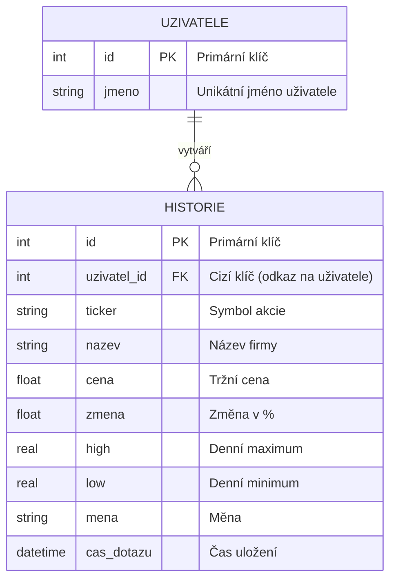

```mermaid
erDiagram
    UZIVATELE ||--o{ HISTORIE : "vytváří"
    UZIVATELE {
        int id PK "Primární klíč"
        string jmeno "Unikátní jméno uživatele"
    }
    HISTORIE {
        int id PK "Primární klíč"
        int uzivatel_id FK "Cizí klíč (odkaz na uživatele)"
        string ticker "Symbol akcie"
        string nazev "Název firmy"
        float cena "Tržní cena"
        float zmena "Změna v %"
        real high "Denní maximum"
        real low "Denní minimum"
        string mena "Měna"
        datetime cas_dotazu "Čas uložení"
    }
```
