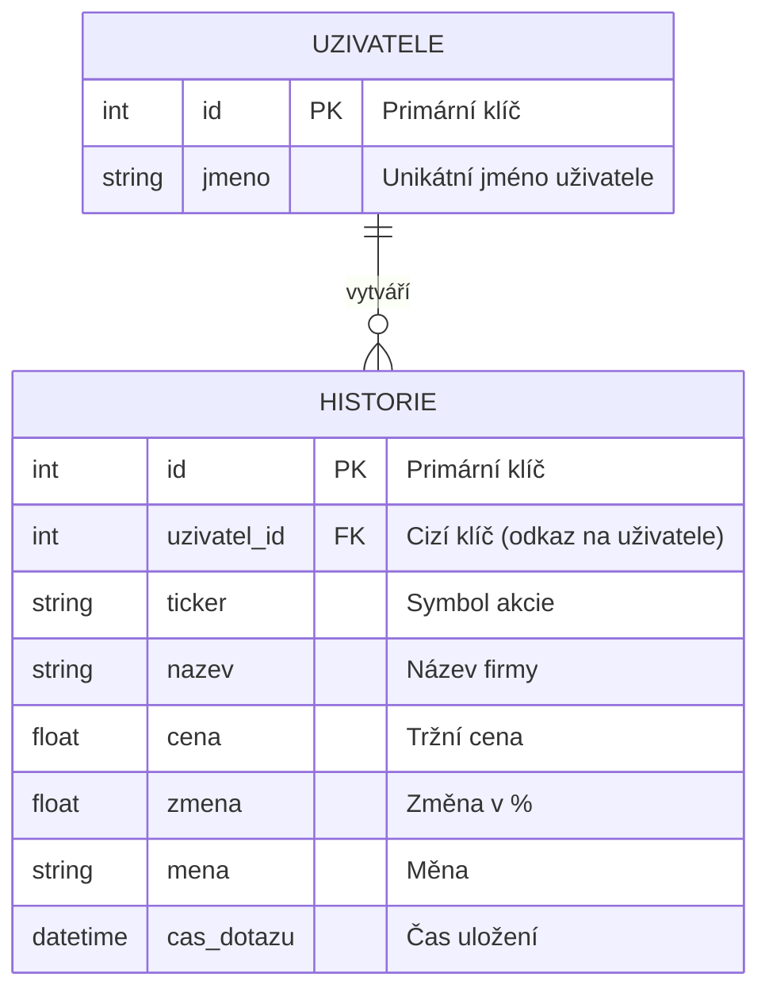

# 📊 Pokus 2: Relační systém s uživateli

Tato verze projektu obsahuje pokročilou databázovou strukturu se dvěma propojenými tabulkami a systémem přihlašování.

## 1. ER Diagram (Vztah 1:N)

## 2. Funkcionalita
- **Systém uživatelů:** Každý uživatel má své vlastní konto.
- **Relace:** Tabulka `historie` je propojena s tabulkou `uzivatele` pomocí cizího klíče `uzivatel_id`.
- **Personalizace:** Uživatel vidí pouze svou historii hledání.
- **Automatická registrace:** Pokud jméno v databázi neexistuje, systém jej při prvním přihlášení vytvoří.

## 3. Jak spustit
1. Jdi do složky `pokus2`.
2. Spusť `python analyzator.py`.
3. Otevři `http://127.0.0.1:5001`.
